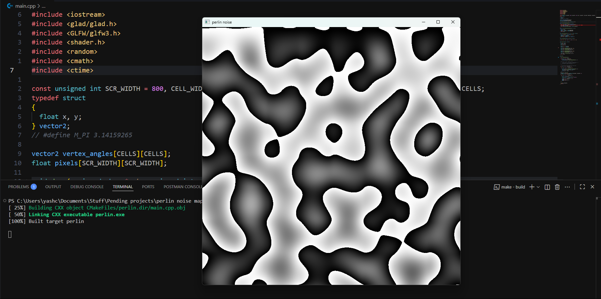

# Perlin Noise Generator

## Screenshots


## usage
```bash
$ git clone https://github.com/yashchaurasia667/perlin-noise-generator
$ cd perlin-noise-generator
$ cmake . -B build -G "MinGW Makefiles"
$ cd build
$ make && .\perlin.exe
```